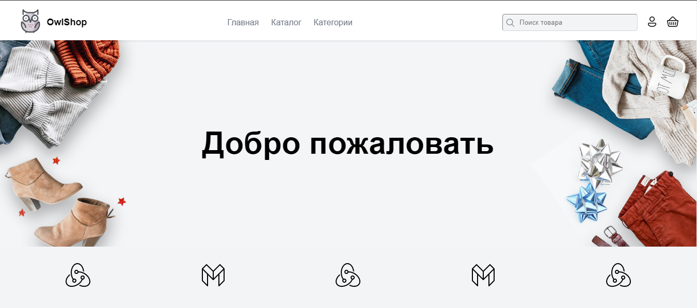

## Описание проекта
Этот проект представляет собой Fullstack приложение для интернет-магазина, разработанное с использованием Vue 3 на фронтенде и Laravel на бекенде. Приложение развернуто в Docker контейнерах, включая контейнеры для фронтенда, бекенда, Nginx сервера и базы данных PostgreSQL.

## Функциональность
**Добавление товара:** Администраторы могут добавлять новые товары на сайт через бекенд.

**Поиск и фильтрация товаров:** Пользователи могут искать и фильтровать товары на фронтенде.

**Регистрация и авторизация:** Пользователи могут регистрироваться и авторизовываться на сайте.

**Добавление товаров в корзину:** Аутентифицированные пользователи могут добавлять товары в свою корзину.

**Добавления рейтинга товара:** в процессе

## Технологии
**Фронтенд:** `Vue 3`, `Vue Router`, `Vuex`

**Бекенд:** `Laravel`, `Sanctum` для аутентификации

**Сервер:** `Nginx`

**База данных:** `PostgreSQL`

**Инфраструктура:** `Docker`, `Docker Compose`

## Установка и запуск
Предварительные требования
Убедитесь, что у вас установлены следующие программы:

`Docker`

`Docker Compose`

## Шаги для запуска проекта
Клонируйте репозиторий на свой компьютер:
```bash
git clone https://github.com/yato90/owl_shop-fullstack.git
```
Перейдите в директорию проекта:
```bash
cd owl_shop-fullstack
```
Соберите и запустите контейнеры с помощью Docker Compose:
```bash
docker-compose up --build --detach
```
Выполните миграции базы данных в контейнере Laravel:
```bash
docker-compose exec owl_shop-backend-1 php artisan migrate
```
## Приложение будет доступно по адресу:

Frontend: http://localhost:3000
Backend: http://localhost

## Конфигурация
**Фронтенд**: Конфигурация фронтенда находится в директории frontend/.

**Бекенд**: Конфигурация бекенда находится в директории backend/.

**Docker**: Docker файлы и конфигурация Docker Compose находятся в корневой директории проекта.

## Использование
**Добавление товара**: Перейти в http://localhost/stuffs/create. Посмотреть созданные по http://localhost/stuffs/index

**Поиск и фильтрация**: Используйте интерфейс пользователя на фронтенде для поиска и фильтрации товаров.

**Регистрация и авторизация**: Используйте формы регистрации и входа на фронтенде.
Корзина: Войдите в систему и используйте функционал корзины для добавления товаров.